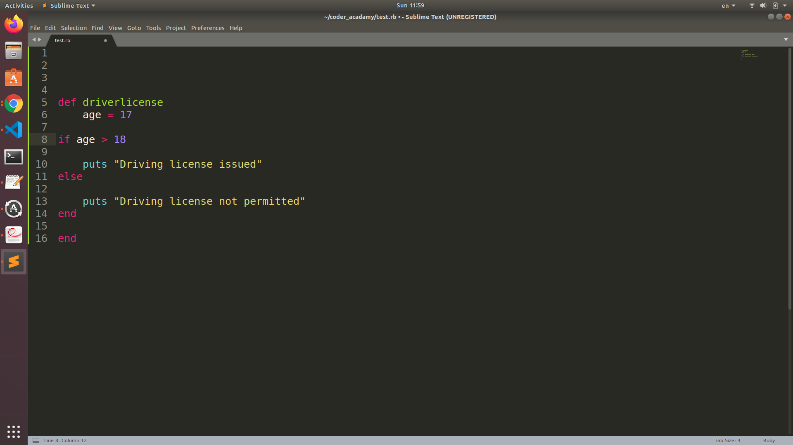
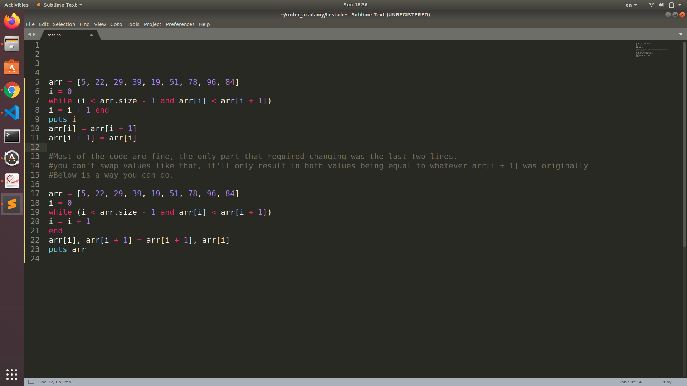

# Question 1

### descripe 5 key the development of the internet from 1980 to today.

- By the beginning 1981, more than 200 computers in dozens of institutions have been connected in CSNET. BITNET, another startup network, is based on protocols that include file transfer via e-mail rather than by the FTP procedure of the ARPA protocols.The Internet Working Group of DARPA publishes a plan for the transition of the entire network from the Network Control Protocol to the TCP/IP protocols developed since 1974 and already in wide use (RFC 801).

- In 1984 the newly developed DNS is introduced across the Internet, with the now familiar domains of .gov, .mil, .edu, .org, .net, and .com. A domain called .int, for international entities, is not much used. Instead, hosts in other countries take a two-letter domain indicating the country.

- In 1986 TCP/IP is available on workstations and PCs such as the newly introduced Compaq portable computer. Ethernet is becoming accepted for wiring inside buildings and across campuses. Each of these developments drives the introduction of terms such as bridging and routing and the need for readily available information on TCP/IP in workshops and manuals. Companies such as Proteon, Synoptics, Banyan, Cabletron, Wellfleet, and Cisco emerge with products to feed this explosion.

- In 1991 first web page created know as world wide web and also the first search protocol that examined file contents instead of just file names was launched, called Gopher.

- In 1998 Google went live in the browser, revolutionizing the way in which people find information online.

### Ref

- https://www.webfx.com/blog/web-design/the-history-of-the-internet-in-a-nutshell/
- https://www.computerhistory.org/internethistory/1980s/
- https://en.wikipedia.org/wiki/Internet

# Question 2

### Define feature how each technology has contributed to the development of the internet.

- packet: every time you access the internet, your data transmissions are split up into ~1000 byte incriments called packets, and sent to its destination by the best calculated route. Packets are commonly split into 3 sections: Header, Payload and Footer. When sending a messafe if the message to be sent is long, each stack layer of photocol that the message passes through may break the message up into smaller chunks of data. This is because data sent over the Internet (and most computer networks) are sent in manageable chunks. On the Internet, these chunks of data are known as packets.

- IP address: is an Internet Protocol address is also known as IP address. It is a numerical label which assigned to each device connected to a computer network  
  which uses the IP for communication. IPv4 was the first version of IP. It was deployed for production in the ARPANET in 1983. Today it is most widely used IP version. It is used to identify devices on a network using an addressing system.
  The IPv4 uses a 32-bit address scheme allowing to store 2^32 addresses which is more than 4 billion addresses. Till date, it is considered the primary Internet Protocol and carries 94% of Internet traffic. It is the most recent version of the Internet Protocol. Internet Engineer Taskforce initiated it in early 1994. The design and development of that suite is now called IPv6. This new IP address version is being deployed to fulfill the need for more Internet addresses. It was aimed to resolve issues which are associated with IPv4. With 128-bit address space, it allows 340 undecillion unique address space. IPv6 also called IPng (Internet Protocol next generation).

- Routers: is a specialized networking device connected to two or more networks running software that allows the router to move data from one network to another, its a common type of gateway. It is positioned where two or more networks meet at each point of presence on the internet. Hundreds of routers might forward a single packet as it moves from one network to the next on the way to its final destination.
  Rounting: how does it work? here is an example: a typical home has a range of internet-connected devices — personal computers, tablets, smartphones, printers, thermostats, smart TVs, and more. With your router, these devices form a network. A router directs incoming and outgoing internet traffic on that network in the fastest and most efficient way.

- Domains and DNS: is use to converts Internet Protocol IP addresses for example from 173.194.39.78 to human readable domain names www.google.com into Internet Protocol, because computers can only communicate using series of numbers, so DNS was developed as a sort of “phone book” that translates the domain you enter in your browser into a computer readable IP.The Domain Name System (DNS) is the phonebook of the Internet that humans access information online through domain names.

### Ref

- https://web.stanford.edu/class/msande91si/www-spr04/readings/week1/InternetWhitepaper.htm
- https://www.guru99.com/difference-ipv4-vs-ipv6.html
- https://www.inetdaemon.com/tutorials/internet/ip/routing/define_router.shtml
- https://searchnetworking.techtarget.com/definition/router
- https://us.norton.com/internetsecurity-iot-smarter-home-what-is-router.html
- https://dnsmadeeasy.com/support/what-is-dns/
- https://www.cloudflare.com/learning/dns/what-is-dns/

# Question 3

### Define the features of the following technologies that are essential in terms of the development of the internet:

- TCP: Transmission Control Protocol is responsible for breaking data down into small packets before they can be sent over a network, and for assembling the packets again when they arrive.

- HTTP: Hyper Text Transfer Protocol takes care of the communication between a web server and a web browser. HTTP is used for sending requests from a web client (a browser) to a web server, returning web content (web pages) from the server back to the client.

- Web brownser: is a software program that allows a user to locate, access, and display web pages. In common usage, a web browser is usually shortened to "browser." Browsers are used primarily for displaying and accessing websites on the internet, as well as other content created using languages such as Hypertext Markup Language (HTML) and Extensible Markup Language (XML).Browsers translate web pages and websites delivered using Hypertext Transfer Protocol (HTTP) into human-readable content. They also have the ability to display other protocols and prefixes, such as secure HTTP (HTTPS), File Transfer Protocol (FTP), email handling (mailto:), and files (file:).
  The most common browser software titles on the market are: Microsoft Internet Explorer, Google's Chrome, Mozilla Firefox, Apple's Safari, and Opera. Browser availability depends on the operating system your computer is using (for example: Microsoft Windows, Linux, Ubuntu, Mac OS, among others).

### Ref

- http://www-db.deis.unibo.it/courses/TW/DOCS/w3schools/website/web_tcpip.asp.html
- https://www.extrahop.com/company/blog/2018/tcp-vs-http-differences-explained/
- https://en.wikipedia.org/wiki/Transmission_Control_Protocol

* https://www.techopedia.com/definition/288/web-browser
* https://www.mozilla.org/en-US/firefox/browsers/what-is-a-browser/
* https://www.allaboutcookies.org/browsers/

# Quuestion 4

### Identify THREE data structures used in the Ruby programming language and explain the reasons for using each.

- Array: are a container used to hold a list of objects. Ruby arrays are ordered, integer-indexed collections of any object. Each element in an array is associated with and referred to by an index. Ruby arrays can hold objects such as String, Integer, Fixnum, Hash, Symbol, even other Array objects. Ruby arrays are not as rigid as arrays in other languages. Ruby arrays grow automatically while adding elements to them.
- Hashes: are another way to store multiple values under a single variable.Hashes is a data structure where every value has a key & this key can be anything, like a string, an integer, a symbol, etc.

- Stack: is a data structure which you can use as a “to-do” list. You keep taking elements from the stack & processing them until the stack is empty. Stack is a last-in-first-out data structure that can be easily implemented using Array. We can simply restrict our interface that wraps an Array to just two operations -- push and pop and some other useful methods to emulate stack like functionality

### Ref

- https://www.tutorialspoint.com/ruby/ruby_arrays.htm
- https://medium.com/the-renaissance-developer/ ruby-101-data-structures-7705d82ec1
- https://www.rubyguides.com/2019/04/ruby-data-structures/
- https://rubymonk.com/learning/books/4-ruby-primer-ascent/chapters/33-advanced-arrays/lessons/86-stacks-and-queues
- https://www.rubyguides.com/2017/03/computer-science-in-ruby-stacks/

# Question 5

### Describe the features of interpreters and compilers and how they are different.

- Compiler: a compiler takes entire program and converts it into object code which is typically stored in a file. The object code is also refereed as binary code and can be directly executed by the machine after linking. Examples of compiled programming languages are C and C++.

- Interpreter: an Interpreter directly executes instructions written in a programming or scripting language without previously converting them to an object code or machine code. Examples of interpreted languages are Perl, Python and Matlab.

### Ref

- https://www.geeksforgeeks.org/compiler-vs-interpreter-2/
- https://www.microcontrollertips.com/compilers-translators-interpreters-assemblers-faq/

# Question 6

### TWO commonly used programming languages and explain the benefits and drawbacks of each.

PHP: PHP is a server side scripting language. that is used to develop Static websites or Dynamic websites or Web applications. PHP stands for Hypertext Pre-processor,PHP scripts can only be interpreted on a server that has PHP installed.
The benefit: 1. Open source: It is developed and maintained by a large group of developers. This will help in creating a support community and abundant extension libraries. 2. Speed: It is relatively fast, since it uses not much system resources. 3. Easy to use: It uses a C like syntax, so for those who are familiar with C, it’s very easy for them. 3. Powerful library support: You can easily find functional modules you need such a PDF, graph etc.
The drawback: 1. Security: Since it is open sourced, all people can see the source code. If there are bugs in the source code, it can be used by people to explore the weakness of it. 2. Not suitable of large applications: It will be difficult to use it for programming huge applications. Since the programming language is not highly modular, huge applications created out of the programming language will be difficult to maintain. 3. Poor Error Handling Method: The framework has a bad error handling method. It is not a proper solution for the developers. Therefore, as a qualified PHP developer, you will have to overcome it. 4. PHP is unable to handle large number of apps: The technology is helpless to support a bunch of apps. It is highly tough to manage because, it is not competent modular. It already imitates the features of Java language.

Ruby: Ruby is a dynamic, open source programming language with a focus on simplicity and productivity. It has an elegant syntax that is natural to read and easy to write.
The benefit: 1. The code written in Ruby has a fewer number of lines of code. 2. This language allows simple and fast creation of Web application which results in much fewer efforts. 3 It is an open source programming language which allows the programmers to modify the code as needed. 4 Ruby is a dynamic programming language. It is also very close to spoken languages.
The drawback: 1. It is fairly new and has its own unique coding language which makes it difficult for the programmers to learn it. After much practice, it gets easy.2 The code written in Ruby is harder to debug as most of the time it generates the errors at runtime. 3 When compared to other languages, Ruby has very less informational resources to learn the language. 4 It is slower than other languages as it is an interpreted scripting language and the scripting languages are slower than the compiled languages.

### Ref

- https://www.php.net/manual/en/intro-whatis.php
- https://www.guru99.com/what-is-php-first-php-program.html
- https://www.phpbabu.com/advantages-and-disadvantages-of-php/
- https://www.ruby-lang.org/en/
- https://technographx.com/ruby-programming-language/

# question 8

### Explain control flow, using an example from the Ruby programming language

If statement: the if keyword is used to check if an expression is true. If it is true, a statement is then executed. The statement can be a single statement or a compound statement. A compound statement consists of multiple statements enclosed by the block. A block is code enclosed by the end keyword.

# Question 9

### Explain type coercion

Type coercion is the changing of an object’s type into another type, together with its value. For example, changing an Integer into a String with #to_s or a Float into an Integer with #to_i. Implicit conversion is automatically handled by the language compiler when you apply operators to values of different compatible types, eg. 5 \* 2.0 = 10.0 (int to float), or '5' - 5 will return 0 (str to int).

# Question 10

### Explain data types.

- Number: Generally a number is defined as a series of digits, using a dot as a decimal mark. Optionally the user can use the underscore as a separator. There are different kinds of numbers like integers and float. Ruby can handle both Integers and floating point numbers. According to their size, there are two types of integers, one is Bignum and second is Fixnum.

Num1 = 10 # This is an integer
Num2 = 4.5 # This is a floating point

- Boolean: Boolean data type represents only one bit of information either true or false.

myBoolean = true
myOtherBoolean = false

- String: string is a group of letters that represent a sentence or a word. Strings are defined by enclosing a text within a single (”) or double (“”) quotes, can use both double quotes and single quotes to create strings.

string_1 = "This is my string!"
string_2 = " " # This is also a string
string_3 = "10" # This is also a string

# question 11

Here’s the problem: “There is a restaurant serving a variety of food. The customers want to be able to buy food of their choice. All the staff just quit, how can you build an app to replace them?”

Identify the classes you would use to solve the problem
Write a short explanation of why you would use the classes you have identified

Classes:

Since staff has quit i would need some class to replace a staff, assume to run a restaurant i would need a team which include: manager, chef, dishwasher, wait-staff.

- First class that i would build is employee super class, which have attributes of name, a weekly hour shift.
- Then i would define another suclass to define other role that need to be done in the restaurant which will be:
  Manager who are able to keep track of what happening in the cafe such as stocking supply, payroll.
  Chef who looking afrer a kitchen section, duty include cooking and report any issue to manager if there is any.
  Dishwashers, to retrieve and wash dirty dishes.
  Wait staff is to greeting customer, seat them and taking thier order.

# Question 12

### Identify and explain the error in the code snippet below that is preventing correct execution of the program

celsius = gets
fahrenheit = (celsius \* 9 / 5) + 32
print "The result is: "
print fahrenheit
puts "."

The error in this code snippet lies in the line celsius = gets. Gets, by default, will interpret the user input as a string data type, and will assign it to the 'celsius' as string to solve this proble have to add gets.chomp then convert celsius to interger by adding to_f or to to_i to the end of celsius.

# Question 13

### The code snippet below looks for the first two elements that are out of order and swaps them; however, it is not producing the correct results. Rewrite the code so that it works correctly.

# Question 14

### Demonstrate your algorithmic thinking through completing the following two tasks, in order

1.  Create a flowchart to outline the steps for listing all prime numbers between 1 and 100 (inclusive). Your flowchart should make use of standard conventions for flowcharts to indicate processes, tasks, actions, or operations
2.  Write pseudocode for the process outlined in your flowchart

- Flowchart

- Pseudocode

Start loop for numbers between 1 - 100 (can exclude 1 as it is not a prime number)

    Assign isPrime variable to true

    Begin second loop for range of 2 - current number

    if i is not equal to current number and current number mod i does not equal 0

    set isPrime to false

    if isPrime is currently true

     print current number

    return to start of first loop.

# Question 15

### Write pseudocode OR Ruby code for the following problem:

You have access to two variables: raining (boolean) and temperature (integer). If it’s raining and the temperature is less than 15 degrees, print to the screen “It’s wet and cold”, if it is less than 15 but not raining print “It’s not raining but cold”. If it’s greater than or equal to 15 but not raining print “It’s warm but not raining”, and otherwise tell them “It’s warm and raining”.

# Question 16

### An allergy test produces a single numeric score which contains the information about all the allergies the person has (that they were tested for). The list of items (and their value) that were tested are:

- eggs (1)
- peanuts (2)
- shellfish (4)
- strawberries (8)
- tomatoes (16)
- chocolate (32)
- pollen (64)
- cats (128)

So if Tom is allergic to peanuts and chocolate, he gets a score of 34.
Write a program that, given a person’s score can tell them:
a) whether or not they’re allergic to a given item
b) the full list of allergies.

